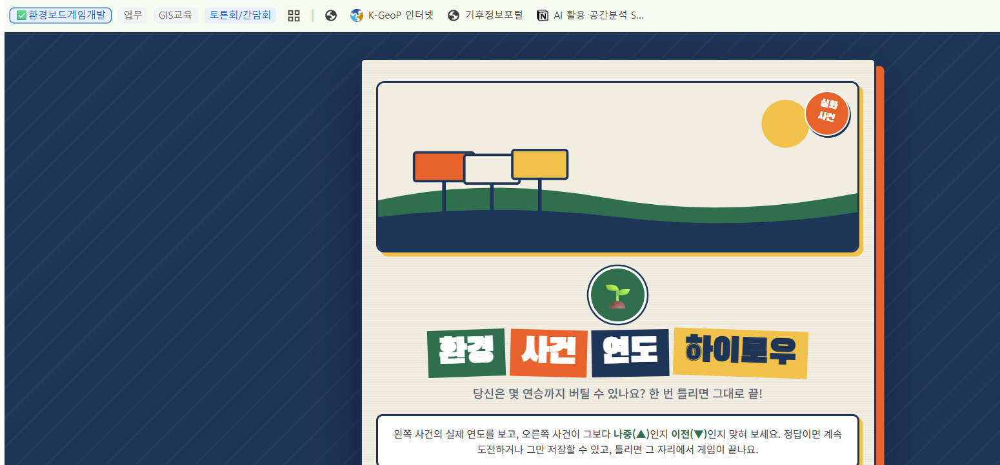
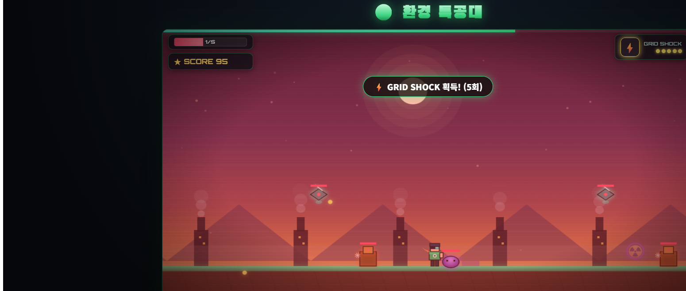

# 🌍 에코 보드게임 (eco-boardgame)

[환경아카이브 풀숲](https://ecoarchive.org)의 공개 데이터를 활용해 만든 웹 미니게임 2종입니다. 별도 설치 없이 브라우저에서 바로 플레이할 수 있습니다.

## 🎮 플레이하기

| 게임 | 링크 |
|---|---|
| 🗓️ 환경 사건 연도 하이로우 | **[바로 플레이](https://cloudhana.github.io/eco-boardgame/index.html)** |
| 🕹️ 환경 특공대 (횡스크롤 액션) | **[바로 플레이](https://cloudhana.github.io/eco-boardgame/game.html)** |

---

## 🗓️ 환경 사건 연도 하이로우

실제 한국 환경운동사 속 사건 두 개를 보여주고, 왼쪽 사건의 연도를 기준으로 오른쪽 사건이 **더 나중(▲)** 인지 **더 이전(▼)** 인지 맞히는 하이로우(High-Low) 게임입니다. 연속 정답 기록에 도전하고, 위험을 감수하지 않으려면 언제든 저장하고 멈출 수 있습니다.



- 정답이면 계속 도전하거나 "그만 저장"으로 안전하게 종료
- 오답이면 그 자리에서 게임 종료 (최고 기록은 브라우저에 저장됨)
- 사건 설명과 풀숲 원문 링크를 함께 제공
- 데이터: [`archivelabedu/ecoarchive-impact2026`](https://github.com/ArchivelabEdu/ecoarchive-impact2026)의 `data/cards.json`을 실시간으로 불러옵니다.

## 🕹️ 환경 특공대

환경을 망치는 적들이 몰려오는 2D 횡스크롤 액션 게임입니다. 기본 공격은 주먹이고, 떨어진 "환경 사건" 아이템을 주우면 그 사건을 테마로 한 특수 공격을 쓸 수 있습니다.



### 무기 (환경 사건 테마)

| 아이템 | 공격 |
|---|---|
| 🟢 녹조(Algae Bloom) | 바닥을 따라 넓게 퍼지는 확산 공격 |
| ☢️ 원전(Meltdown) | 범위 안의 적에게 지속 피해를 주는 낙진구름 |
| ⚡ 송전탑(Grid Shock) | 가까운 적들을 순서대로 감전시키는 연쇄 전격 |

### 특징

- 적을 처치해도 그 자리에 **오염 흔적**이 남아 밟으면 피해를 입습니다 (벌목 흔적 / 매연 잔재 / 폐수 웅덩이)
- 적 3종: 벌목 로봇, 매연 드론, 폐수 슬라임
- 키보드(← → 이동, ↑/Space 점프, Z/F 공격) 또는 화면의 터치 버튼으로 조작
- WebAudio 기반 효과음 내장

---

## 📁 구성

```
index.html   환경 사건 연도 하이로우
game.html    환경 특공대 (횡스크롤 액션)
uploads/     디자인 시안 참고 이미지
screenshots/ README용 스크린샷
```

두 파일 모두 외부 라이브러리 없이 순수 HTML/CSS/JS로 작성되었으며, Google Fonts만 CDN으로 불러옵니다.

## 🙏 출처

이 프로젝트는 재단법인 숲과나눔이 운영하는 [환경아카이브 풀숲](https://ecoarchive.org)과 [`ecoarchive-impact2026`](https://github.com/ArchivelabEdu/ecoarchive-impact2026) 공개 데이터를 참고하여 만들었습니다.
